# Linux Terminal Lab

> Hands-on Linux terminal lab completed using **Termux on Android** as part of the **BoyCode Africa Cybersecurity Track**.

---

## 📖 Overview

This repository documents my Linux Terminal Lab practical, where I learned and practiced fundamental Linux commands through hands-on exercises. The lab focused on command-line navigation, file management, environment variables, networking, process management, and text editing.

---

## 🎯 Objectives

- Learn basic Linux terminal commands.
- Practice file and directory management.
- Understand Linux environment variables.
- Explore networking and process management commands.
- Document the practical using GitHub.

---

## 🛠️ Environment

| Item | Details |
|------|---------|
| Device | Oppo A15s (CPH2179) |
| Terminal | Termux |
| Shell | Bash |
| Platform | Android (Linux-based) |

---

## 📚 Commands Practiced

### Navigation
- `pwd`
- `ls`
- `cd`

### File Management
- `cat`
- `mkdir`
- `cp`
- `mv`
- `rm`
- `rmdir`

### File Listing
- `ls -a`
- `ls -l`
- `ls -R`

### Searching & Sorting
- `grep`
- `sort`
- `which`
- `history`

### Help
- `ls --help`

### Environment Variables
- `echo`
- `env`
- `export`
- `unset`

### Networking
- `ping`
- `ssh` *(availability checked)*

### Process Management
- `ps`
- `top`
- `df -h`
- `free -h`
- `sleep`
- `pidof`
- `kill`

### Text Editing
- Attempted `vi` and `vim` *(not installed in the default Termux environment)*
- Used `nano` as the available text editor.

---

## 💡 Skills Gained

- Linux Command Line
- Bash Fundamentals
- File System Navigation
- File Management
- Environment Variables
- Networking Basics
- Process Management
- System Monitoring
- Technical Documentation

---

## 📷 Lab Screenshots

### Screenshot 1 – Project Setup

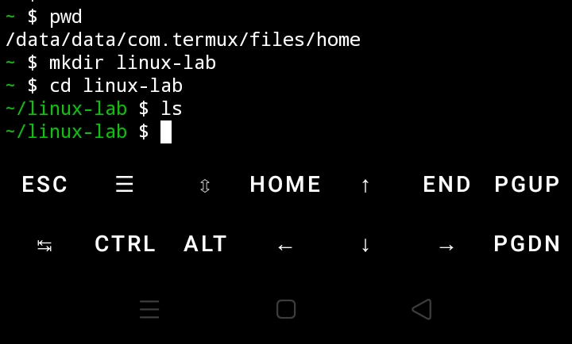

### Screenshot 2 – Creating and Viewing Files

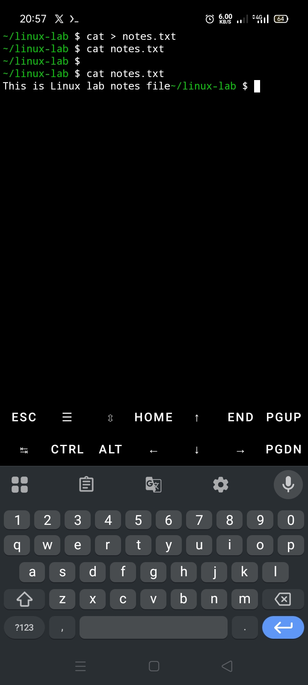

### Screenshot 3 – Copying and Renaming Files

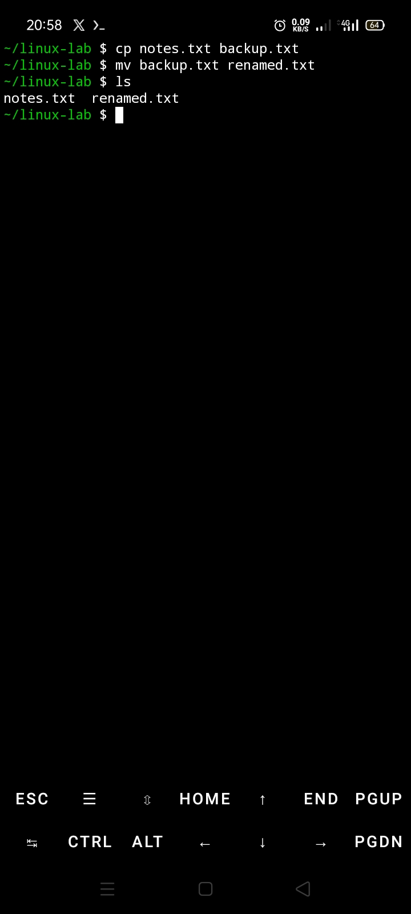

### Screenshot 4 – Directory Management

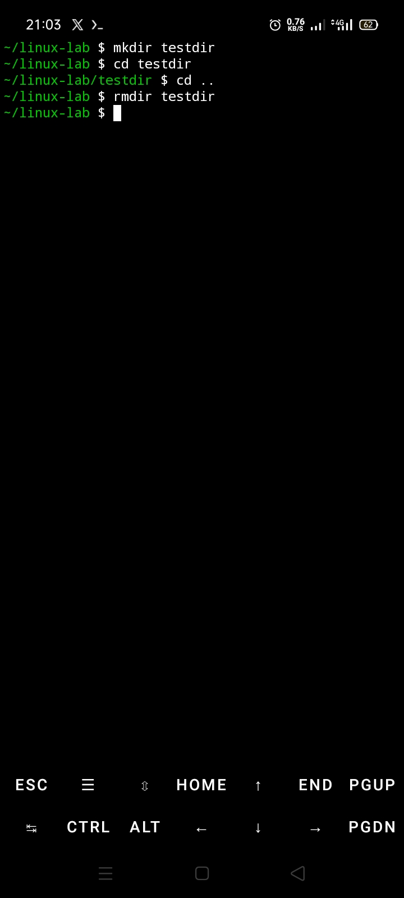

### Screenshot 5 – Listing Files

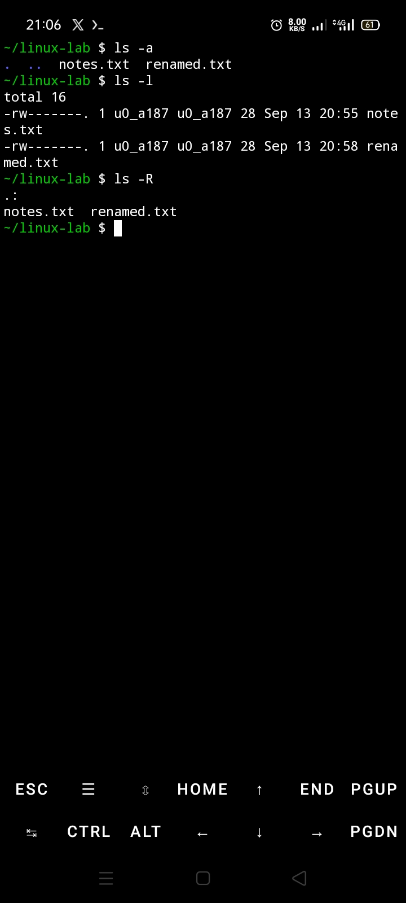

### Screenshot 6 – Searching and Sorting

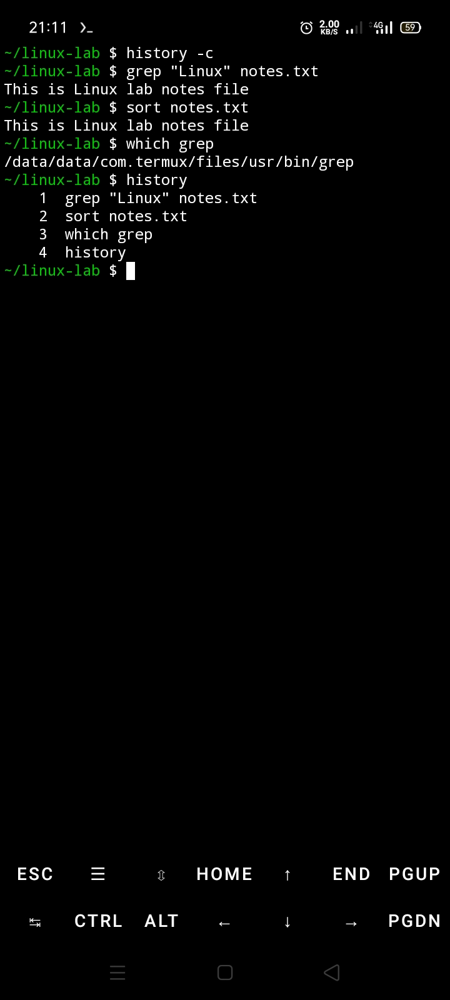

### Screenshot 7 – Help Commands and Environment Variables

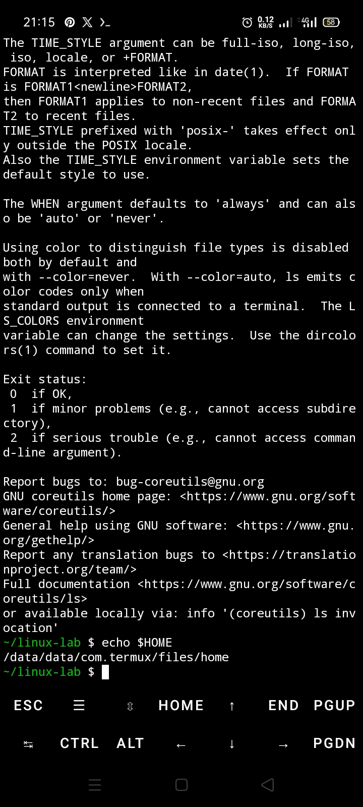

### Screenshot 8 – Managing Environment Variables

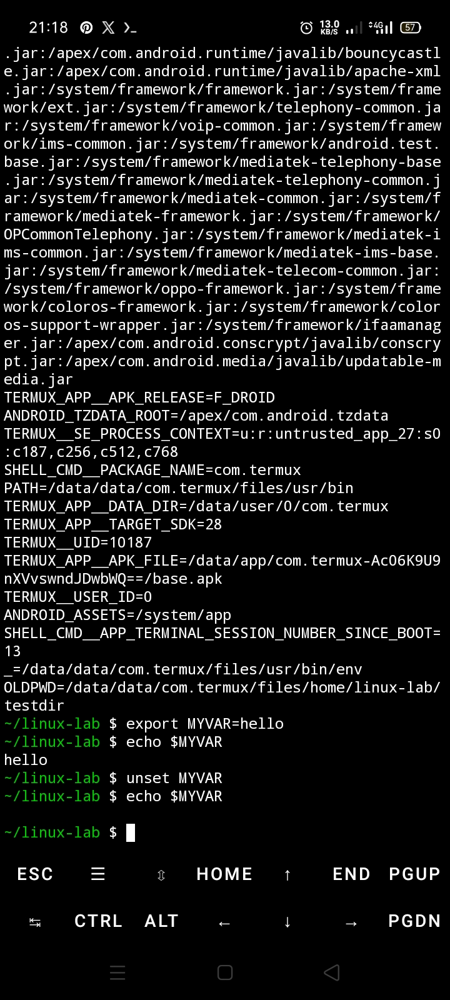

### Screenshot 9 – Networking Commands

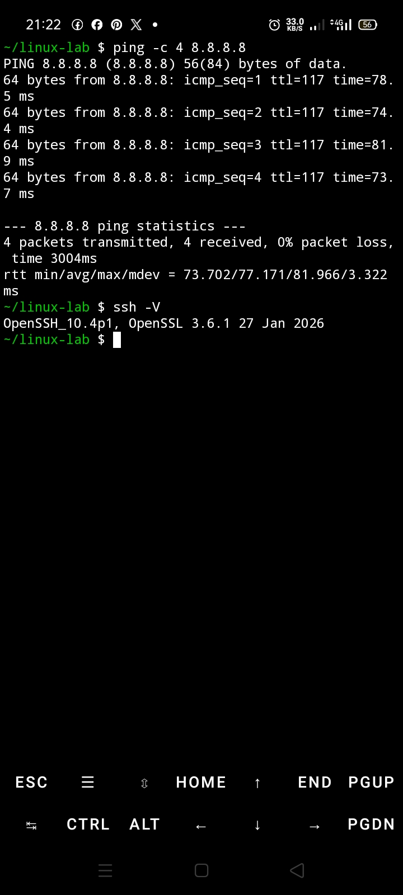

### Screenshot 10 – System Monitoring

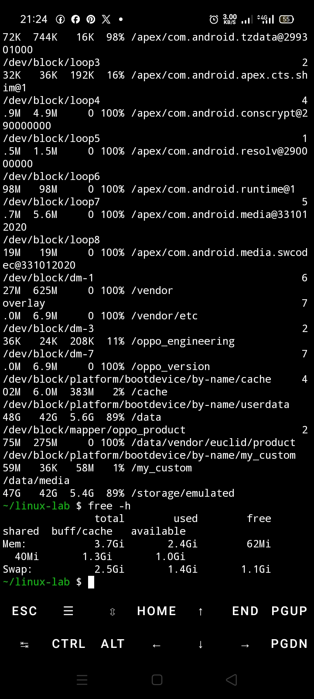

### Screenshot 11 – Background Process Management

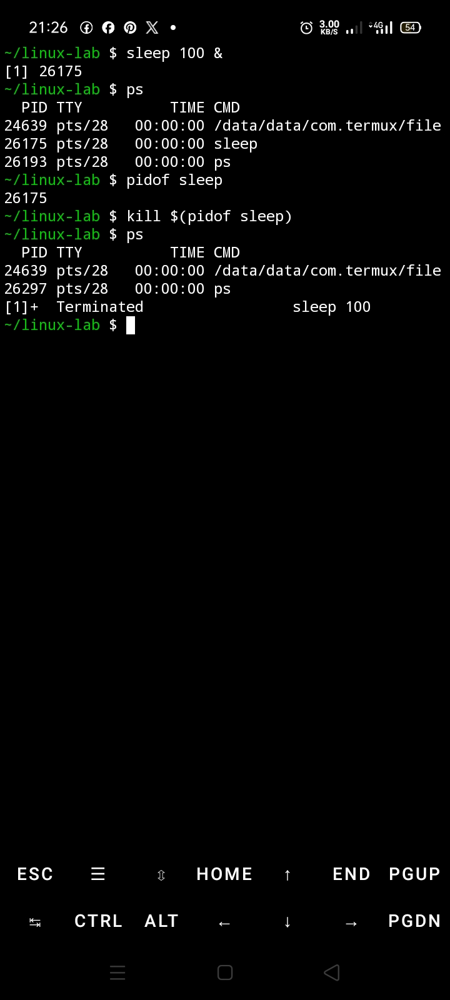

### Screenshot 12 – Text Editing with Nano

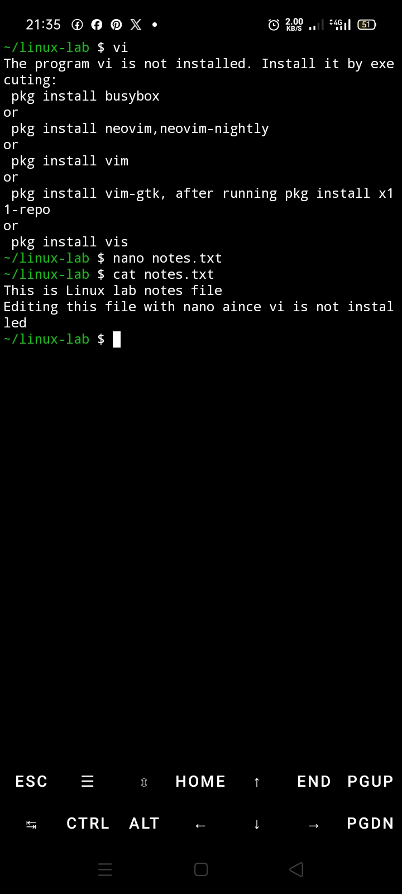

### Screenshot 13 – Cleanup

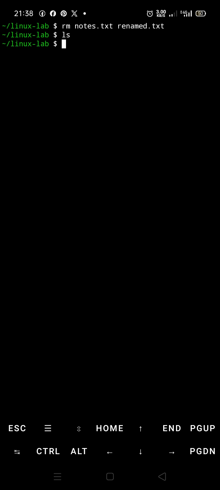

---

## 📝 Notes

This assignment was completed using **Termux on Android** instead of a traditional Linux workstation.

Some commands from the Linux cheat sheet (`vi`, `vim`, and `ssh`) were not available in the default Termux installation. Where appropriate, suitable alternatives such as **Nano** and `ls --help` were used.

---

## 🚀 Conclusion

Completing this practical strengthened my understanding of the Linux command line and reinforced the importance of hands-on learning. Although the assignment was completed on a mobile device, it demonstrates the same Linux fundamentals used in cybersecurity and system administration.

---

## 👤 Author

**Samuel Nwankwo**

**Program:** BoyCode Africa Cybersecurity Track

**Year:** 2026
